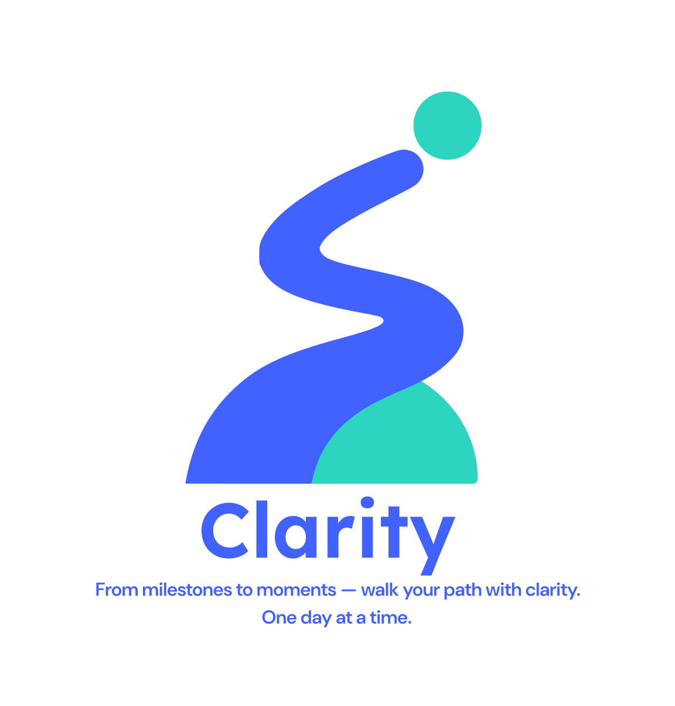

<p align="center">
  
</p>

<h1 align="center">Clarity</h1>
<p align="center"><em>From milestones to moments — walk your path with clarity. One day at a time.</em></p>

---

> 🚧 **This project is currently under construction.**  
> We’re building something meaningful — a cross-platform recovery companion that helps you track progress, reflect deeply, and stay grounded in your journey.

---

## 🔧 Tech Stack

This monorepo is powered by:

- **Web App**: Next.js + TailwindCSS + Clerk
- **Mobile App**: React Native (Expo)
- **Backend API**: Ruby on Rails (API-only) + PostgreSQL
- **AI Integration**: OpenAI GPT-4o (for journaling, chat companion, and HALT checks)
- **PDF Export**: Grover (HTML-to-PDF)

## 📁 Monorepo Structure

```
clarity/
├── apps/
│   ├── web/          # Next.js frontend
│   ├── mobile/       # Expo mobile app
│   ├── api/          # Rails API
├── packages/
│   ├── ui/           # Shared Tailwind component library
│   ├── prompts/      # AI prompt logic
│   ├── types/        # Shared TS types
│   └── auth/         # Auth utilities (Clerk, JWT)
└── bin/              # Setup and dev scripts
```

## 🚀 Getting Started

```bash
# Setup everything
bin/setup

# Run all dev servers
bin/dev
```

## 📌 Status

We’re moving fast — first public alpha coming soon.  
For now, sit tight and stay tuned. 🧠💙

---

<p align="center">
  <sub>© 2025 Clarity • Built with intention.</sub>
</p>
